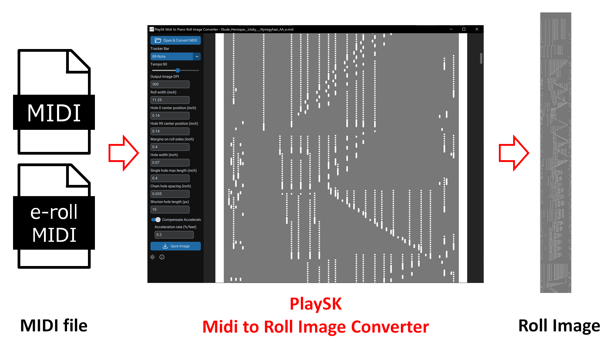

# PlaySK MIDI to Piano Roll Image Converter Ver1.1

Converts MIDI file to piano roll image.

The converted image can be played on [PlaySK Piano Roll Reader](https://github.com/nai-kon/PlaySK-Piano-Roll-Reader).
Also the converted image might be converted to G-Code for laser perforator, using standard software. (My goal is to be able to output G-Code directly)

# Support Tracker Bar

* 88-note
* Ampico A/B

In the future, more tracker bars will supported such as 65-note, Aeolian 176-note, Duo-Art, etc.

# Tips

* Currently, Multi-track midi file is not supported.
* Currently, tempo change event during music is not supported
* The output DPI can be changed. If DPI is large, conversion takes a lot of time and RAM. The default 300 DPI is recommended.
* Image is saved as .PNG for efficient file size.
* Turn ON roll acceleration compensation, the roll will become drawn out towards the end. The default roll acceleration is 0.18% per feet, based on Stanford Univ paper. There are opinions that the Stanford paper is not correct, so it will be changed in the future.
* Sustain/soft pedal control change events are mapped to hole #4 and #98 of 100 holes.
* Shorten hole length adjusts the note length shorter. MIDI are often longer than the actual hole.

# Donation

Your support greatly contributes to the continuous development and improvement of the Software. Please consider donating.

https://www.paypal.com/paypalme/KatzSasaki
